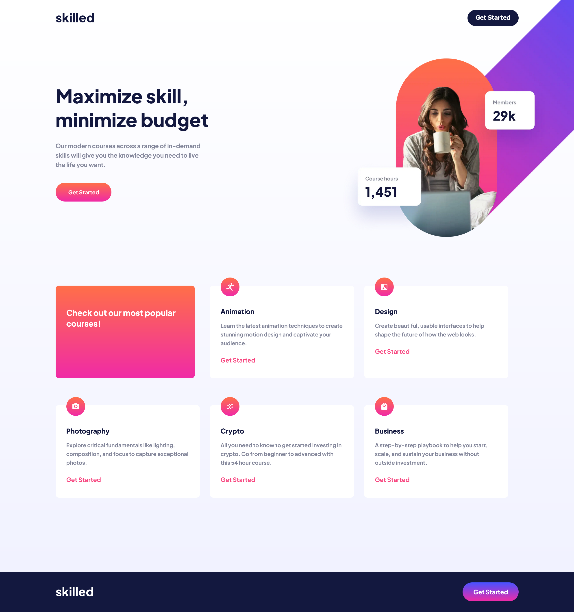

# Frontend Mentor - Skilled e-learning landing page solution

This is a solution to the [Skilled e-learning landing page challenge on Frontend Mentor](https://www.frontendmentor.io/challenges/skilled-elearning-landing-page-S1ObDrZ8q). Frontend Mentor challenges help you improve your coding skills by building realistic projects.

## Table of contents

- [Overview](#overview)
  - [The challenge](#the-challenge)
  - [Screenshot](#screenshot)
  - [Links](#links)
- [My process](#my-process)
  - [Built with](#built-with)
  - [What I learned](#what-i-learned)
  - [Continued development](#continued-development)
  - [Useful resources](#useful-resources)
- [Author](#author)
- [Acknowledgments](#acknowledgments)

## Overview

### The challenge

Users should be able to:

- View the optimal layout depending on their device's screen size
- See hover states for interactive elements

### Screenshot

### Links

- Solution URL: [FrontendMentor solution](https://www.frontendmentor.io/solutions/skilled-elearning-landing-page-DlhHf-fYUS)
- Live Site URL: [skilled-elearning-04](https://skilled-elearning-landing-page-cyan.vercel.app/)

## My process

### Built with

- Semantic HTML5 markup
- Flexbox
- CSS Grid
- Mobile-first workflow

### What I learned

I finally figure out positioning images without dealing with a scrollbar. 
Overflow clip margin came to the rescue, so far, positioning was one of my weakest skills but I'm glad I figured it out. 
I wonder why that propertie was difficult to find when googling. For some reason it worked on day and the next it didn't unless I defined it as 0. 
No idea why.
I originally started with a desktop first design, but after feedback on my last challenge and I restarted it in a mobile first mindset. 
I actually enjoy this method more. I'm having less issues scaling up. Not sure when it's best to use CSS resets so I didn't use it here. 
I used grid for the first time in this project and I had many issues with scaling that up, so maybe for those properties it would've been for the best. So I want to practice that more of that in the future. Any feedback would help! I tried to implement all the notes I had for my last challenge! 

### Continued development

I was originally going to use some CSS frameworks like SCSS and others, but I want to fix the things from the lasgt challenges first, also I didn't want to touch
javaScript until neccesary. So, moving forward, I will try other simple frameworks.

### Useful resources

- [https://css-tricks.com/almanac/properties/o/overflow-clip-margin/](https://css-tricks.com/almanac/properties/o/overflow-clip-margin/) - This was a massive help
that I needed in the last challenge.

## Author

- Frontend Mentor - [@tbeagle2](https://www.frontendmentor.io/profile/tbeagle2)

## Acknowledgments

Thank you @emestabillo who gave me much needed feedback on the last challenge. Their notes were very much needed!

