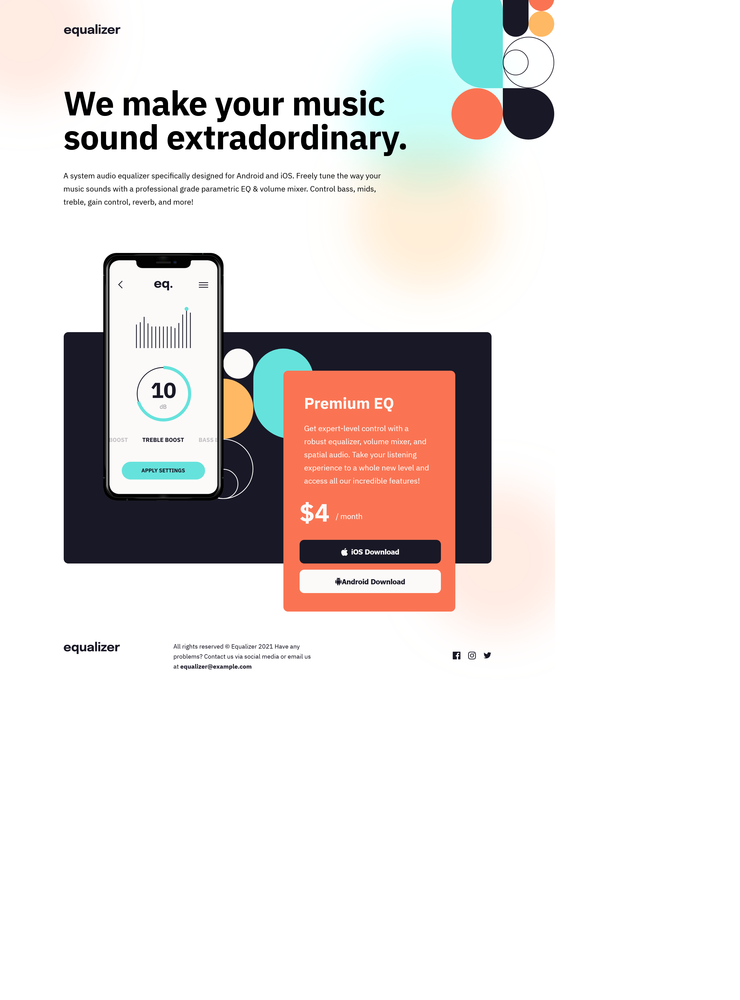

# Frontend Mentor - Equalizer landing page solution

This is a solution to the [Equalizer landing page challenge on Frontend Mentor](https://www.frontendmentor.io/challenges/equalizer-landing-page-7VJ4gp3DE). Frontend Mentor challenges help you improve your coding skills by building realistic projects. 

## Table of contents

- [Overview](#overview)
  - [The challenge](#the-challenge)
  - [Screenshot](#screenshot)
  - [Links](#links)
- [My process](#my-process)
  - [Built with](#built-with)
  - [What I learned](#what-i-learned)
  - [Continued development](#continued-development)
- [Author](#author)

## Overview

### The challenge

Users should be able to:

- View the optimal layout depending on their device's screen size
- See hover states for interactive elements

### Screenshot

### Links

- Solution URL: [FrontendMentor-solution](https://www.frontendmentor.io/solutions/equalizer-landing-page-kHsOvkmnFz)
- Live Site URL: [Equalizer-landing-site](https://frontend-extravaganza-part-2.vercel.app/)

## My process

### Built with

- Semantic HTML5 markup
- CSS custom properties
- SASS/SCSS
- Flexbox
- Mobile-first workflow

### What I learned

learned to use SASS, which allowed me to comparmentalize my CSS and use functions and variables. There was a bug where using the margin property didn't work unless it defined each one in it's own property, for example, instead of margin: 1px 2px 3px 4px, i had to use margin-top: 1px, margin-right: 2px, etc. I used Prepros for the SASS. Next project i'm just going to use npm and node for it.

### Continued development

I want to focus more on the pros of the Sass framework

## Author

- Frontend Mentor - [@tbeagle2](https://www.frontendmentor.io/profile/tbeagle2)
