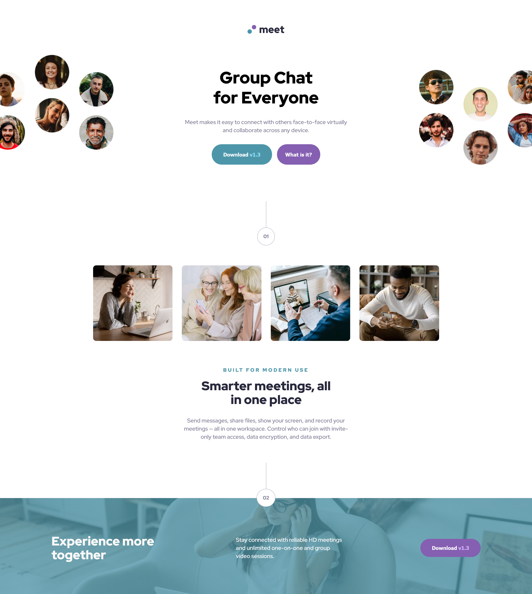

# Frontend Mentor - Meet landing page solution

This is a solution to the [Meet landing page challenge on Frontend Mentor](https://www.frontendmentor.io/challenges/meet-landing-page-rbTDS6OUR). Frontend Mentor challenges help you improve your coding skills by building realistic projects. 

## Table of contents

- [Overview](#overview)
  - [The challenge](#the-challenge)
  - [Screenshot](#screenshot)
  - [Links](#links)
- [My process](#my-process)
  - [Built with](#built-with)
  - [What I learned](#what-i-learned)
  - [Continued development](#continued-development)
- [Author](#author)

**Note: Delete this note and update the table of contents based on what sections you keep.**

## Overview

### The challenge

Users should be able to:

- View the optimal layout depending on their device's screen size
- See hover states for interactive elements

### Screenshot

### Links

- Solution URL: [FrontendMentor-solution](https://www.frontendmentor.io/solutions/meet-landing-page-7QyfGFTxvb)
- Live Site URL: [meet-landing-page](https://meet-landing-page-ten-sigma.vercel.app/)

## My process

### Built with

- Semantic HTML5 markup
- CSS custom properties
- Flexbox
- CSS Grid
- Mobile-first workflow
- SASS
- Parcel

### What I learned

3 hours set up. Using more compartmentalized code, the set up was longer, but it made my code more DRY. Because of that, it took longer to finish this project, but for larger projects I believe this can reduce the time and amount of code.
Seems like font size going from figma to a browser isn't 100%, had issues with fitting text inside the buttons. One of them had a paragraph element in it and the other didn't. It seems it's best to have a text element inside the button than to just have the text in the button. Still having a bug where I can't use Margin and padding to define all the sides, but I have to define each side individually using margin-top, margin-right, etc, which is annoying. I'm going to try another pre-processer next time to see if I have the same issues.
I also noticed, the images provided are never crystal clear in the browser, I wonder why that is?
This also took three weeks because I was working a lot. But after not looking at the code for two weeks, I was able to come back to it with minimal issues, which is a good progress.
I packaged with parcel this time, I was told it was more light weight but the package seems huge compared to the last packager I used. Not sure why? Also getting Parcel to work with Vercel was more than annoying if you're using SASS as there doesn't seem to be any good documentation on how to do so. Finally figure out I had to add the root directory as dist in Vercel.

### Continued development

I'm getting better at going back to refactor elements to work better in all query sizes. Before I seemed to be aversed to change the HTML after I finished the mobile or tablet view. I'm also getting better pre-planning, I didn't need to go back to change the HTML so it works for all views, so progress.

## Author

- Frontend Mentor - [@tbeagle2](https://www.frontendmentor.io/profile/tbeagle2)

